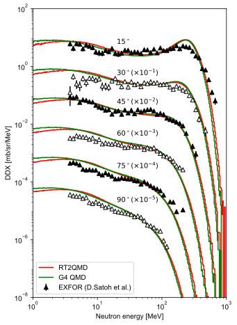

# RT2QMD
RT2 Quantum Molecular Dynamics (QMD) Event Generator for nucleus-nucleus collision simulation

## Features
- GPU-accelerated QMD model

- Generates phase-space distributions of secondary particles from nucleus-nucleus collision events:
  - photons, neutrons, protons, and heavier nuclei

- Pions or delta baryons productions are **not** considered

- Energy range: **100 MeV/u to 500 MeV/u**

Cross-platform support:
 - Windows 10 
 - Ubuntu

## Getting Started

### Requirements
- **CMake** >= 3.7 (tested: 3.25.1)

- **C++17** (tested on Visual Studio 2019, g++ 9.4.0)

- **CUDA** >= 11.x (tested: CUDA 12.2 and 12.6)

- **GPU**: Nvidia Pascal (GTX 10xx) or later 

 - GTX 1660 super, Nvidia RTX 4060 ti, Nvidia RTX 4090 tested

- **GSL**: GNU Scientific Library

- (Optional) **vcpkg** package manager

- (Optional) **Python3** >= 3.8 (tested: 3.8.10, 3.8.20)

### Installation

git clone https://github.com/dlc2048/RT2QMD.git

cd RT2QMD

mkdir build

cd build

#### Configure

- without vcpkg

cmake3 ../ 

- with vcpkg

cmake3 ../ -DUSE_VCPKG=1

#### Build

##### Linux

make

cd ..

export MCRT2_HOME=$(pwd)

##### Windows

Open build/RT2QMD.sln in Visual Studio

Build the solution

Set environment variable:
MCRT2_HOME = $(RT2QMD_home_directory)

#### (optional) Python interface

cd RT2QMD/interface

pip3 install .

## Backgrounds

- This package is based on the relativistic Quantum Molecular Dynamics (QMD) model (https://doi.org/10.1016/0370-1573(91)90094-3)

- GPU implemented with reference to Geant4 QMD model

- This event generator is part of the RT2 Monte Carlo code (https://doi.org/10.1088/1361-6560/ad694f)

## License

Apache-2.0 License. See **LICENSE** for details

## Contact

### Technical or bug issues

Author: Chang-Min Lee

Email: dlc2048@snu.ac.kr

### Corresponding author

Author: Sung-Joon Ye

Email: sye@snu.ac.kr

## Examples

- Example 1. C12-C12 neutron DDX [/examples/1_ddx_c12c12_290MeVu]

- Example 5. C12-C12 collision dump [/examples/5_qmd_dump]

